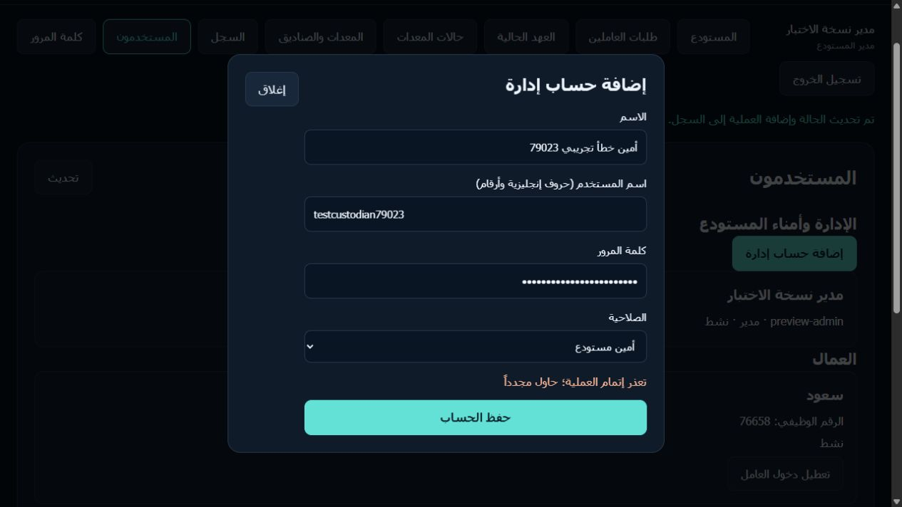
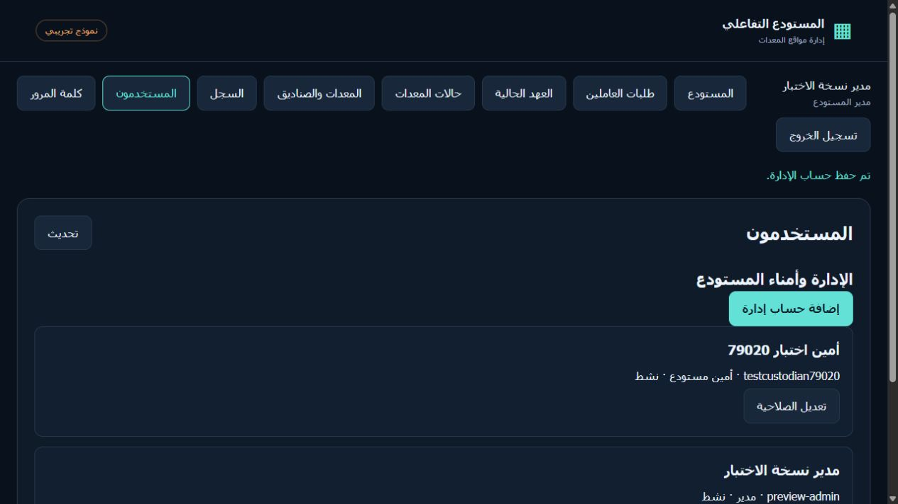
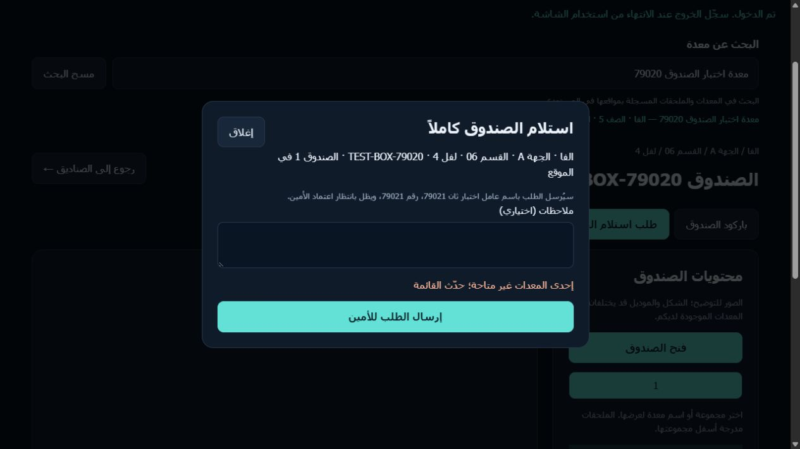

# تقرير اختبار المتصفح — 2026-09-20

البيئة: فرع `codex/production-ready-windows` فقط. خادم Preview محلي على `127.0.0.1`، PostgreSQL-compatible PGlite مؤقتة في ذاكرة كل عملية، والواجهة وEdge handler وmigrations الفعلية. لم تُستخدم قاعدة Supabase بعيدة، ولم يتغير `main` أو الموقع الحي. الاختبار تم عبر متصفح Codex In-app Browser؛ ليس اعتمادًا على قراءة الكود وحدها.

## بيانات الاختبار

- مدير Preview: `preview-admin` (الاعتماد الاختباري الموثق في `DEPLOYMENT.md`).
- عامل أول: `عامل اختبار ٢٠٢٦` / `79020`، عامل ثانٍ: `عامل اختبار ثان 79021` / `79021`.
- أمين تجريبي: `أمين اختبار 79020` / `testcustodian79020` في الخادم المصحح فقط.
- قطعة المصدر: منشار جنزير للخرسانة في `برافو / A / القسم 01 / لفل 1 / SA-008`.
- صندوق مستقل أُنشئ عبر الواجهة: `TEST-BOX-79020` في `الفا / A / القسم 06 / لفل 4`، وفيه `معدة اختبار الصندوق 79020` بقطعتين معتمدتين.

## نتائج المتصفح

| السيناريو | النتيجة |
| --- | --- |
| دخول العامل والبحث عن المنشار وفتح موقعه على الخريطة والصندوق | نجح؛ ظهر الموقع والقطعة المتاحة |
| طلب قطعة، متابعة الطلب، اعتماد المدير، ظهورها في العهدة | نجح؛ العهدة بقيت صفرًا قبل الاعتماد ثم صارت قطعة واحدة |
| طلب الإرجاع، فحص المدير، السجل السابق | نجح؛ اختفت العهدة وظهر تاريخ الخروج والعودة وحالتهما |
| تحديث الصفحة وإعادة دخول العامل | نجح؛ سجل العهدة والطلب بقي محفوظًا داخل عملية Preview |
| طلب صندوق يحتوي أصنافًا غير مُراجعة | مُنع كما ينبغي برسالة مراجعة المحتويات |
| إنشاء صندوق واختبار قطعتين، طلبه كاملاً، الرفض ثم إعادة الطلب والاعتماد | نجح؛ ظهر سبب الرفض ثم ظهرت القطعتان في العهدة بعد الاعتماد |
| محاولة عامل ثانٍ صرف الصندوق المصروف | مُنعت؛ قطعتان «بعهدة عامل»، ورفضت الواجهة/الخدمة الطلب برسالة عدم التوفر |
| عزل عهدة العامل الثاني وشاشات الإدارة | نجح؛ عهدته فارغة ولا تظهر أدوات إدارة العاملين له |
| تغيير حالة قطعة متاحة إلى «في الصيانة» ثم إعادتها | نجح؛ زر طلبها تعطل في الصيانة، ثم عادت «متاحة» وسُجّل التغيير |
| سجل المدير ومراجعة العمليات | نجح؛ ظهرت أحداث الإنشاء والمراجعة والرفض والصرف والإرجاع وهوية المنفذ |
| إنشاء حساب أمين في Preview القديم على 8000 | فشل بخطأ عام؛ السبب غياب محاكي Supabase Auth لعملية الإنشاء |
| إنشاء الأمين ودخوله واعتماد الصرف والإرجاع بعد الإصلاح على 8001 | نجح؛ لم تظهر له شاشة «المستخدمون» الخاصة بالمدير |

## إصلاح وتحقق إضافي

أُضيف مخزن هويات مؤقت داخل `scripts/test-preview.mjs` بدل محاولة استدعاء Supabase Auth الحقيقي في Preview. بقي `warehouse_staff_control` و`warehouse_api` مسؤولَين عن الصلاحيات. اختبار `tests/preview.test.mjs` يثبت إنشاء الأمين، منعه من إنشاء مدير أو عرض حسابات الإدارة، تغيير كلمة مروره، رفض طلب صرف قطعة مُعارة (`409`)، عدد العهد النشطة في قاعدة PGlite، وأحداث الصرف والإرجاع. بعد الإصلاح: `npm run check` ناجح و`npm test` ناجح `19/19`.

## صور الدليل

## حدود وحكم الجاهزية

- لم تُختبر قاعدة Supabase بعيدة أو RLS على مشروع staging فعلي أو GitHub Pages الحي؛ ذلك يتطلب بيئة staging واعتمادات لم تُقدم، ولا يجوز تجربة هذه الرحلات على الإنتاج.
- Preview يحفظ البيانات عند تحديث الصفحة وإعادة الدخول، لكنه **لا يحفظها بعد إيقاف الخادم أو إعادة تشغيل الجهاز**. لا يُعد تخزينًا إنتاجيًا دائمًا.
- سباقات الاعتماد المتزامنة وIDOR وحماية audit log اختُبرت آليًا على PGlite/SQL، وليس باختبار حمل متعدد المستخدمين على PostgreSQL بعيد.
- تحديثات المخزون من تبويب إداري آخر لا تظهر في بحث عامل مفتوح مسبقًا إلا بعد إعادة تحميل الصفحة؛ رفض الطلبات غير المتاحة يبقى مفروضًا في الخدمة. تحسين التحديث الحي لاحقًا مطلوب لتجربة الاستخدام.
- لم يُختبر عرض الهاتف أو قارئ باركود مادي. روابط QR وخريطة الموقع ظهرت، لكن المسح بكاميرا فعلية خارج نطاق هذه الجلسة.

**الحكم:** نسخة Preview المصححة مناسبة لتجربة وظيفية محلية، وليست جاهزة للنشر الحي قبل اختبار staging فعلي، الاستمرارية الدائمة، المراجعة البصرية على الأجهزة المستهدفة، والتحقق التشغيلي من Supabase.
